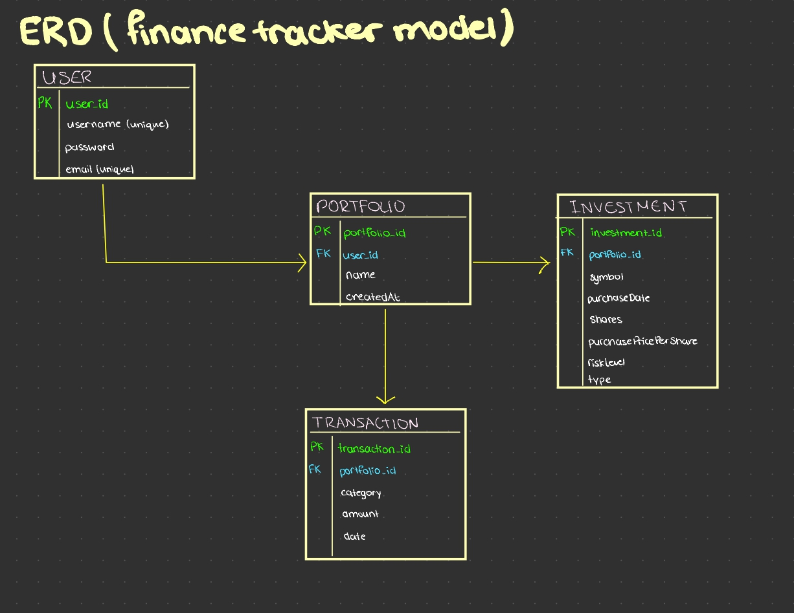

# 💰 Finance Tracker & Investment Simulator

The **Finance Tracker & Investment Simulator** is a full-stack educational web app designed for **students and young adults** to learn budgeting, saving, and investing, all in one place.  
It combines **a finance tracker** (for managing daily expenses and savings) with **a virtual investment simulator**, where users can practise making investments without any real-world risk.

---

## Project Motivation

When I started university, I realised how hard it was to manage money effectively. Most budgeting apps were either **too complex**, **not engaging**, or required **paid subscriptions**.  

So I decided to build **my own finance app**. One that’s intuitive, visually engaging, and educational.

The idea grew into a system that doesn’t just track expenses but also helps users **learn how investments work**, safely and realistically.

Users can save, spend, and simulate buying stocks, tracking their growth using **live market prices** pulled via API without risking real money.

---

## Core Concepts & Skills Demonstrated

### Full-Stack Architecture
* **Backend:** Java + Spring Boot REST API
* **Frontend:** React.js with modern hooks (useEffect, useCallback, useMemo)
* **Database:** MySQL
* **Authentication:** JWT-based secure login system with role-based access

### Object-Oriented Programming (OOP)
* Built modular classes and services (e.g., `InvestmentService`, `UserService`, `TransactionService`)
* Applied encapsulation, inheritance, and abstraction for code scalability and clarity
* Used polymorphism in handling different transaction types (income, expense, investment)

### Data Structures & Algorithms
* Used data structures like `ArrayLists`, `HashMaps`, and `LinkedHashSets` to manage transactions and portfolio data efficiently
* Implemented algorithms for **balance calculation**, **growth projection**, and **investment performance visualization**
* Focused on **time-efficient data retrieval** for real-time portfolio updates

### Database Schema (ERD Diagram)
To illustrate the data relationship and persistence layer.

#### Database Login Console
*The console used to access the database during development.*
 

### API Integration
* Frontend communicates securely with the backend using **Axios** and **JWT Bearer Tokens**
* Implemented **RESTful endpoints** for CRUD operations (Create, Read, Update, Delete)
* Integrated **third-party financial data APIs** to fetch live stock prices dynamically

### Frontend Engineering
* Developed a responsive React dashboard with reusable components
* Integrated **data visualization** libraries for displaying portfolio growth, expense trends, and savings distribution
* Focused on clean UI and user-centered interaction flow
* Learned how to work with Bezier curves (sort of)

### Authentication & Security
* **JWT token validation** using custom Spring Security filters (`JwtAuthFilter`)
* Stateless session management and secure password hashing (**BCrypt**)
* CORS configuration for safe frontend–backend communication

### Backend Engineering Principles
* **Layered architecture** (Controller → Service → Repository)
* Exception handling with global error responses
* Clean separation of business logic and persistence layers

---

## Current Features

* ✅ Secure login and registration system
* ✅ Add, view, and delete expenses & income
* ✅ Real-time balance updates
* ✅ Simulated investments with live stock prices
* ✅ Data visualizations (spending breakdowns, balance trends)
* ✅ Fully connected frontend and backend (React + Spring Boot)

---

### 📸 Application Screenshots

Take a look at the web app in action:

#### 1. Authentication & Navigation
The secure login terminal and the dashboard entry screen.

| Login Terminal | Start Page |
| :---: | :---: |
|  |  |

#### 2. Finance Tracker (Transactions View)
The primary screen for monitoring finances, viewing balances, and logging income/expenses.

| Transactions Overview | Logging Income/Expense |
| :---: | :---: |
|  |  |

#### 3. Investment Simulator
The module for practicing investments, purchasing virtual stocks, and tracking the portfolio.

| Investment Manager | Portfolio Summary |
| :---: | :---: |
|  |  |

---

## In Progress / Coming Soon

* 🔹 **Investment Logic Enhancements** – buying/selling simulation, profit/loss tracking, and portfolio history
* 🔹 **Advanced Data Visualization** – interactive charts for investment growth over time
* 🔹 **Improved Transaction Categorization** – machine-learning-based expense grouping (experimental idea)
* 🔹 **Performance Optimization** – caching, request batching, and pagination

---

## Tech Stack

| Category | Tools & Technologies |
| :--- | :--- |
| **Frontend** | React.js, TailwindCSS |
| **Backend** | Java, Spring Boot, Spring Security, REST APIs |
| **Database** | MySQL, JPA/Hibernate |
| **Auth** | JWT |
| **Data Visualization** | Recharts / Chart.js |
| **Testing** | Postman |

---
## Known Technical Improvements / Next Steps

This project is still evolving, and I'm actively improving the structure as I learn.  
A few things I already know I want to refactor:

### 1. Consistent API Responses  
Some controllers return raw objects while others use `ResponseEntity`.  
My plan is to unify everything under a consistent response format so the API feels cleaner and easier to consume.

### 2. Clearer Separation of Concerns  
A few service methods currently mix:
- database access  
- business rules  
- data formatting  

I'd like to separate these into proper layers (repository → service → formatter/analysis) to keep the logic easier to test and maintain.

### 3. Removing Duplicate Logic  
Fetching the current user and portfolio appears in multiple places.  
This will be extracted into a shared component/utility so the logic only lives in one place.

### 4. Moving Model Logic Out of Entities  
Some models contain extra calculated fields or analysis logic.  
These should move into a dedicated `PortfolioAnalysisService` to keep entities lightweight and focused.

### 5. Better Error Handling  
Right now, different controllers handle errors differently.  
I'm planning to add a global `@ControllerAdvice` exception handler so the API responds in a consistent way.

### 6. Improving MarketDataService  
The market data layer works, but could be more resilient.  
Next step: add caching + retry logic to reduce unnecessary API calls and handle outages more gracefully.

---

I’m continuously refactoring this codebase as I learn more about clean architecture and backend best practices.
  
---

## Next Steps
Im currently refining:
* the investment buying/selling logic
* the data visualization and analytics layer
* full deployment pipeline (Docker, AWS, CI/CD)
I plan to complete these as I balance studies.

---

## Setup & Run

> **Note:** The app currently requires authentication and backend setup, so cloning it for use won’t work fully unless connected to your local backend with valid JWT setup. However, feel free to explore the codebase. It demonstrates secure backend integration, API design, and full-stack logic.
